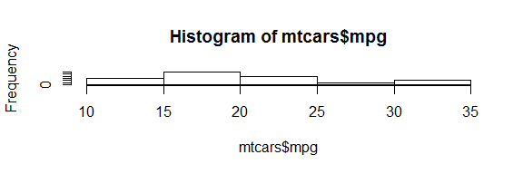
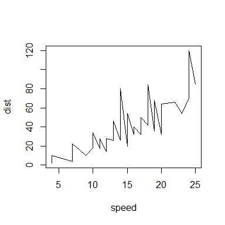
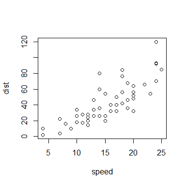
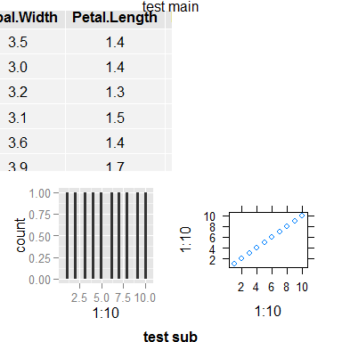
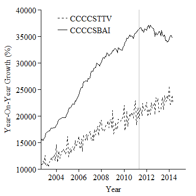
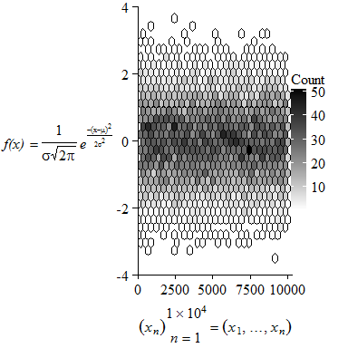
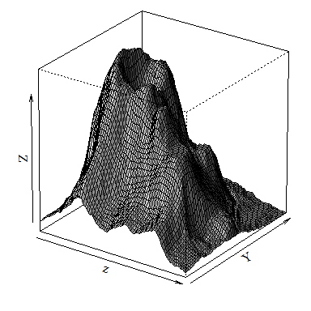

-   Main Heading
    -   Subscript and Superscript
    -   Text format
    -   Line Break
-   Plotting
    -   Custom figure width
    -   Multiple figure captions
    -   Lattice together multiple ggplot
    -   Testing Cache with above lattice
    -   Images
-   Tables
    -   with kable
    -   with xtable
    -   Manually markdown a table
-   Pile of plot
    -   Subheading1
    -   Subheading2
    -   Colours in R

Main Heading
============

Subscript and Superscript
-------------------------

H<sub>2</sub>O is a liquid.
2<sup>10</sup> is 1024.
P<sub>a cat</sub>

Text format
-----------

"Double Quotes" *"Double Quotes Italic"* **"Double Quotes Bold"**

> 1.  "*One backtick end and one single end, two each side.*"
> 2.  *"One backtick end and one single end, two each side."*
> 3.  *'One backtick end and one single end, two each side.*'

1.  one
2.  two

Line Break
----------

* * * * *

Plotting
========

Custom figure width
-------------------

``` {.r}
hist(mtcars$mpg)
```



Multiple figure captions
------------------------

``` {.r}
plot(cars,type='l')
```



``` {.r}
plot(cars)
```



Lattice together multiple ggplot
--------------------------------

``` {.r}
library(ggplot2)
library(gridExtra)
```

    Loading required package: grid

``` {.r}
library(lattice)
```

    Warning: package 'lattice' was built under R version 3.0.3

``` {.r}
grid.arrange(qplot(1:10), xyplot(1:10~1:10),
tableGrob(head(iris)), nrow=2, as.table=TRUE, main='test main',
sub=textGrob('test sub', gp=gpar(font=2)))
```

    stat_bin: binwidth defaulted to range/30. Use 'binwidth = x' to adjust this.



Testing Cache with above lattice
--------------------------------

``` {.r}
library(ggplot2)
library(gridExtra)
library(lattice)
grid.arrange(qplot(1:10), xyplot(1:10~1:10),
tableGrob(head(iris)), nrow=2, as.table=TRUE, main='test main',
sub=textGrob('test sub', gp=gpar(font=2)))
```

    stat_bin: binwidth defaulted to range/30. Use 'binwidth = x' to adjust this.


Images
------


Tables
======

with kable
----------

``` {.r}
library(knitr)
kable(head(mtcars[,1:3]), format='pandoc', caption='c aligned',align='c')
```

||mpg|cyl|disp|
|---|:-:|:-:|:--:|
|Mazda RX4|21.0|6|160|
|Mazda RX4 Wag|21.0|6|160|
|Datsun 710|22.8|4|108|
|Hornet 4 Drive|21.4|6|258|
|Hornet Sportabout|18.7|8|360|
|Valiant|18.1|6|225|

``` {.r}
kable(head(mtcars[,1:3]), format='pandoc', caption='l aligned',align='l')
```

||mpg|cyl|disp|
|---|:--|:--|:---|
|Mazda RX4|21.0|6|160|
|Mazda RX4 Wag|21.0|6|160|
|Datsun 710|22.8|4|108|
|Hornet 4 Drive|21.4|6|258|
|Hornet Sportabout|18.7|8|360|
|Valiant|18.1|6|225|

``` {.r}
kable(head(mtcars[,1:3]), format='pandoc', caption='l c c aligned',align=c('l','c','c'))
```

||mpg|cyl|disp|
|---|:--|:-:|:--:|
|Mazda RX4|21.0|6|160|
|Mazda RX4 Wag|21.0|6|160|
|Datsun 710|22.8|4|108|
|Hornet 4 Drive|21.4|6|258|
|Hornet Sportabout|18.7|8|360|
|Valiant|18.1|6|225|

``` {.r}
head(mtcars)
```

                   mpg cyl disp  hp drat    wt  qsec vs am gear carb

Mazda RX4 21.0 6 160 110 3.90 2.620 16.46 0 1 4 4 Mazda RX4 Wag 21.0 6 160 110 3.90 2.875 17.02 0 1 4 4 Datsun 710 22.8 4 108 93 3.85 2.320 18.61 1 1 4 1 Hornet 4 Drive 21.4 6 258 110 3.08 3.215 19.44 1 0 3 1 Hornet Sportabout 18.7 8 360 175 3.15 3.440 17.02 0 0 3 2 Valiant 18.1 6 225 105 2.76 3.460 20.22 1 0 3 1

``` {.r}
kable(head(mtcars))
```

||mpg|cyl|disp|hp|drat|wt|qsec|vs|am|gear|carb|
|:--|--:|--:|---:|--:|---:|--:|---:|--:|--:|---:|---:|
|Mazda RX4|21.0|6|160|110|3.90|2.620|16.46|0|1|4|4|
|Mazda RX4 Wag|21.0|6|160|110|3.90|2.875|17.02|0|1|4|4|
|Datsun 710|22.8|4|108|93|3.85|2.320|18.61|1|1|4|1|
|Hornet 4 Drive|21.4|6|258|110|3.08|3.215|19.44|1|0|3|1|
|Hornet Sportabout|18.7|8|360|175|3.15|3.440|17.02|0|0|3|2|
|Valiant|18.1|6|225|105|2.76|3.460|20.22|1|0|3|1|

with xtable
-----------

``` {.r}
library(xtable)
data(iris)
print(xtable(head(mtcars),caption='in latex type'), type='latex',
include.rownames=F, comment=F)
```

\begin{table}[ht]
\centering
\begin{tabular}{rrrrrrrrrrr}
  \hline
mpg & cyl & disp & hp & drat & wt & qsec & vs & am & gear & carb \\ 
  \hline
21.00 & 6.00 & 160.00 & 110.00 & 3.90 & 2.62 & 16.46 & 0.00 & 1.00 & 4.00 & 4.00 \\ 
  21.00 & 6.00 & 160.00 & 110.00 & 3.90 & 2.88 & 17.02 & 0.00 & 1.00 & 4.00 & 4.00 \\ 
  22.80 & 4.00 & 108.00 & 93.00 & 3.85 & 2.32 & 18.61 & 1.00 & 1.00 & 4.00 & 1.00 \\ 
  21.40 & 6.00 & 258.00 & 110.00 & 3.08 & 3.21 & 19.44 & 1.00 & 0.00 & 3.00 & 1.00 \\ 
  18.70 & 8.00 & 360.00 & 175.00 & 3.15 & 3.44 & 17.02 & 0.00 & 0.00 & 3.00 & 2.00 \\ 
  18.10 & 6.00 & 225.00 & 105.00 & 2.76 & 3.46 & 20.22 & 1.00 & 0.00 & 3.00 & 1.00 \\ 
   \hline
\end{tabular}
\caption{in latex type} 
\end{table}
``` {.r}
print(xtable(head(mtcars),caption='in latex type'), type='latex',
include.rownames=T, comment=F)
```

\begin{table}[ht]
\centering
\begin{tabular}{rrrrrrrrrrrr}
  \hline
 & mpg & cyl & disp & hp & drat & wt & qsec & vs & am & gear & carb \\ 
  \hline
Mazda RX4 & 21.00 & 6.00 & 160.00 & 110.00 & 3.90 & 2.62 & 16.46 & 0.00 & 1.00 & 4.00 & 4.00 \\ 
  Mazda RX4 Wag & 21.00 & 6.00 & 160.00 & 110.00 & 3.90 & 2.88 & 17.02 & 0.00 & 1.00 & 4.00 & 4.00 \\ 
  Datsun 710 & 22.80 & 4.00 & 108.00 & 93.00 & 3.85 & 2.32 & 18.61 & 1.00 & 1.00 & 4.00 & 1.00 \\ 
  Hornet 4 Drive & 21.40 & 6.00 & 258.00 & 110.00 & 3.08 & 3.21 & 19.44 & 1.00 & 0.00 & 3.00 & 1.00 \\ 
  Hornet Sportabout & 18.70 & 8.00 & 360.00 & 175.00 & 3.15 & 3.44 & 17.02 & 0.00 & 0.00 & 3.00 & 2.00 \\ 
  Valiant & 18.10 & 6.00 & 225.00 & 105.00 & 2.76 & 3.46 & 20.22 & 1.00 & 0.00 & 3.00 & 1.00 \\ 
   \hline
\end{tabular}
\caption{in latex type} 
\end{table}
Manually markdown a table
-------------------------

<table>
<caption>The table's caption.</caption>
<colgroup>
<col width="22%" />
<col width="22%" />
<col width="29%" />
</colgroup>
<thead>
<tr class="header">
<th align="left">Fruit</th>
<th align="left">Price</th>
<th align="left">Advantages</th>
</tr>
</thead>
<tbody>
<tr class="odd">
<td align="left"><p>Bananas</p></td>
<td align="left"><p>$1.34</p></td>
<td align="left"><ul>
<li>built-in wrapper</li>
<li>bright color</li>
</ul></td>
</tr>
<tr class="even">
<td align="left"><p>Oranges</p></td>
<td align="left"><p>$2.10</p></td>
<td align="left"><ul>
<li>cures scurvy</li>
<li>tasty</li>
</ul></td>
</tr>
</tbody>
</table>

Pile of plot
============

``` {.r}
library(ggplot2)
library(scales)
library(grid)
apa_style <-
   theme_bw(base_size=12,base_family='serif') %+replace%
   theme(axis.text=element_text(size=12),
      legend.text=element_text(size=12),
      axis.ticks=element_line(colour='black'),
      axis.line=element_line(),
      axis.title.x=element_text(vjust=-.1),
      axis.title.y=element_text(vjust=.3, angle=90),
      panel.background=element_blank(),
      panel.border=element_blank(),
      panel.grid.minor=element_blank(),
      panel.grid.major=element_blank(),
      plot.background=element_blank(),
      legend.background=element_blank(),
      legend.key=element_rect(fill=NA,colour=NA),
      legend.title=element_text(face=NULL)   )
```

Subheading1
-----------

``` {.r}
library(XLConnect)
```

    Loading required package: rJava
    XLConnect 0.2-5 by Mirai Solutions GmbH
    http://www.mirai-solutions.com ,
    http://miraisolutions.wordpress.com

``` {.r}
library(reshape2)
tf <- tempfile()
download.file(
 'http://www.rba.gov.au/statistics/tables/xls/c01hist.xls'
 ,tf,mode='wb')
credit <- as.data.frame(readWorksheet(loadWorkbook(tf,
 create=F),sheet='Data',startRow=11,header=T))
Long_CD_Data <- melt(credit[212:nrow(credit),
 c('Series.ID','CCCCSTTV','CCCCSBAI')], id='Series.ID')
ggplot(Long_CD_Data,aes(Series.ID,value,linetype=variable))+
 scale_linetype_manual(values=c(2,1))+geom_line(size=.5)+
 apa_style+labs(x='Year',y='Year-On-Year Growth (%)')+
 theme(legend.position=c(.3,.92),
 legend.title=element_blank())+
 scale_y_continuous(limits=c(10000,40000),expand=c(0,0),
 breaks=seq(10000,40000,5000))+
 scale_x_datetime(expand=c(0,0),breaks='2 years',
 labels=date_format('%Y'))+
 geom_vline(colour='grey',xintercept=as.numeric(
 Long_CD_Data$Series.ID[260]))
```

    Warning: Removed 28 rows containing missing values (geom_path).



Subheading2
-----------

``` {.r}
data <- data.frame(Normal.Dist=rnorm(10000))
ggplot(data, aes(x=as.numeric(rownames(data)),y=Normal.Dist))+ 
 stat_binhex(colour='black') + apa_style +
 scale_fill_gradientn(colours=c('white','black'),name='Count')+
 scale_x_continuous(limits=c(0,nrow(data)+350),expand=c(0,0))+
 scale_y_continuous(limits=c(-4,4),expand=c(0,0))+
 theme(legend.position=c(1.1,.5),
 legend.key.width=unit(4.5,'mm'),
 legend.key.size=unit(7,'mm'),
 plot.margin=unit(c(2,16,2,0),'mm'),
 axis.title.y=element_text(angle=0,vjust=.5))+
 ylab(expression(paste(italic('f(x)')==frac(1,sigma*sqrt(2*pi)),italic(' e')^{frac(-(x-mu)^2, 2*sigma^2)})))+
 xlab(expression((italic(x[n]))*atop(1%*%10^4,italic('n')==1)==(list(italic(x)[1], ..., italic(x[n])))))
```



``` {.r}
library(graphics)
z <- volcano
names(postscriptFonts())
```

     [1] "serif"                "sans"                 "mono"                
     [4] "AvantGarde"           "Bookman"              "Courier"             
     [7] "Helvetica"            "Helvetica-Narrow"     "NewCenturySchoolbook"
    [10] "Palatino"             "Times"                "URWGothic"           
    [13] "URWBookman"           "NimbusMon"            "NimbusSan"           
    [16] "URWHelvetica"         "NimbusSanCond"        "CenturySch"          
    [19] "URWPalladio"          "NimbusRom"            "URWTimes"            
    [22] "ComputerModern"       "ComputerModernItalic" "Japan1"              
    [25] "Japan1HeiMin"         "Japan1GothicBBB"      "Japan1Ryumin"        
    [28] "Korea1"               "Korea1deb"            "CNS1"                
    [31] "GB1"                 

``` {.r}
windowsFonts(A=windowsFont('Courier'))
par(family='serif',ps=12,mar=c(1.5,1,0,0))
persp(z
,theta=35
,phi=25
,shade=.7
,r=50
,lwd=.5
#,ticktype='detailed'
,ltheta=-50
#,nticks=5
#,expand=.5
)
```



Colours in R
------------


